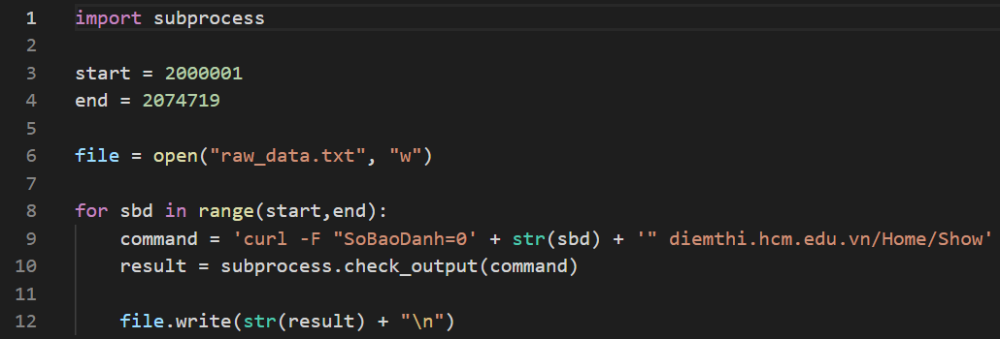
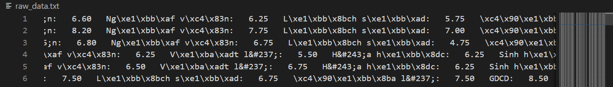
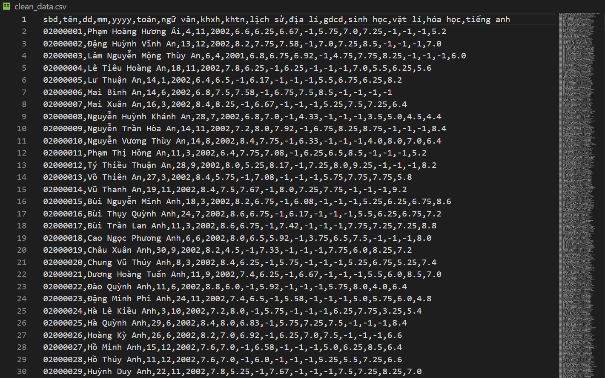
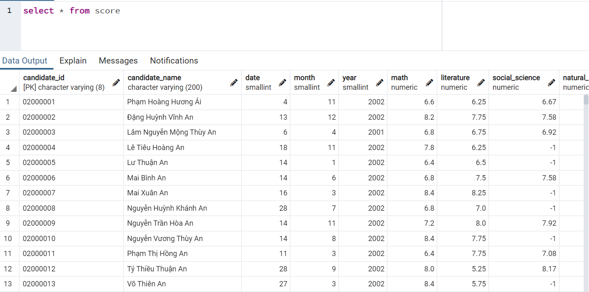
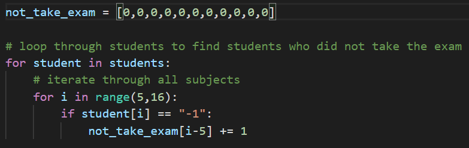
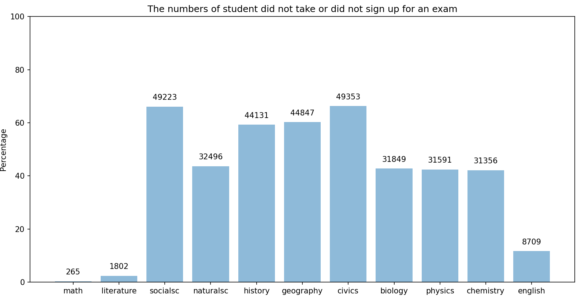
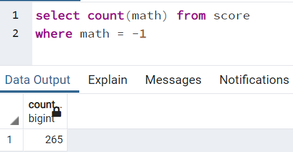
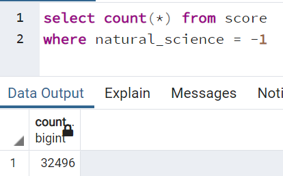
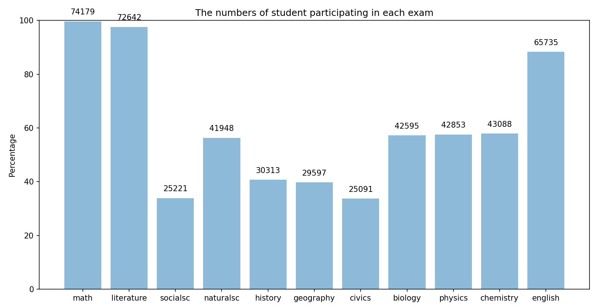

# Analyzing Vietnamese Graduation Score 2020 (HCM City)

**Author: Anh N. Ngo**

---
**Overview:**
- Exploit Python to curl and clean data of more than 74000 candidates, including their full names, date of birth, scores of each exam element: Math, Literature, Social science, Natural science, History, Geography, Civics, Biology, Chemistry, Physics, and English
- Utilize Matplotlib library to draw charts for analyzing collected data
- Create a database in pgAdmin and extract output using SQL queries to assess the accuracy and efficiency of the coding part
- Collaborate SQL with Python and Excel for driving the analytical result
---
**References**:
1. Author: Dung Lai Lap Trinh
   - Published on: Oct 24, 2020
   - Title: Phân tích điểm thi đại học 2020 bằng Data Science | Lập Trình Python Cơ Bản Tự Học Cho Người Mới
   - URL: https://www.youtube.com/watch?v=hkF_oIm3lU4&t=2068s
---
**Introduction**

When a Vietnamese student reaches the age of 18, they are required to take the Vietnamese High School National Graduation Exam in order to be considered for admission to a national institution. Approximately 1 million candidates apply each year. I will harvest data from all candidates in Ho Chi Minh City (HCMC), Vietnam's most populous province, for this project. I'll utilize certain approaches to glean insights from all of the students' scores in order to answer some often asked questions.

---
# Cleaning Data
Curl all information on student scores from the Education & Training Department of HCMC, Vietnam's website, using their ids.
The first id was 2000001, and the latest id was 2074719, as determined by various testing (All raw data was extracted in the year of 2020, leading to the fact that running the code at the moment may cause errors)

All of the data obtained was not cleansed, and there were tags, superfluous codes, and unsupported symbols that needed to be converted to utf8.
I applied the same code to the entire dataset using readline() after coding to process one line and ensuring that it worked properly. Several lines of raw_data.txt:

However, upon cleaning the entire dataset, I discovered that certain ids were "missing," resulting in a list index that was out of range. To avoid this, I used a try - except condition to catch all non-existent ids and then returned them to the for loop in an if condition. *error id.txt* contains non-existent ids.

I imported csv module to save my clean_data as csv file, as I would use it create a database in pgAdmin and apply some queries using SQL.
Several first lines of my clean_data in VSCode:

Several first lines of my clean_data in pgAdmin:

---
# Analyzing Data
I made some charts using the clean database to answer some of my inquiries concerning candidates for the 2020 Vietnamese Graduation Exams in Ho Chi Minh City. These are some of them:
- How many students did not take the exam for each subject, such as Math and History? What is the cause of this occurrence?
- Which topic exam did the majority of students take?
- What were the subjects' median, mode, and mean scores?
- Did the system have any specific errors?
- Were there any candidates in 2020 who were older or younger than the general candidate age (18)?

**A. How many students did not take the exam for each subject?**

To identify the number of students who did not sit for each subject exam, I first established a loop through students to find students who did not sit for the exam, and then I stored them as a list:

The result I got was:
[265, 1802, 49223, 32496, 44131, 44847, 49353, 31849, 31591, 31356, 8709]

Using Matplotlib, I got a bar graph indicating these numbers:

Using the SELECT COUNT query, double-check the retrieved numbers by selecting three subjects at random: Math, Natural Science, and Chemistry:

Three randomly selected columns showed a match with the chart coded by Python, I concluded that the result was well completed.

***Insight:***
- Students who did not take natural science did not take chemistry, biology, or physics either. It's simple to comprehend because chemistry, biology, and physics are natural sciences that are utilised to construct the natural science exam.
- On the other hand, while it is true that students who did not take social science had a far higher likelihood of not taking history, geography, or physics, there are still over 5,000 gaps as illustrated.
- The number of students who did not take the Math exam was rather low. This is because math, literature, and English are obligatory tests that cannot be avoided.

Reversely, I computed a chart showing the number of students taking each exam component:

