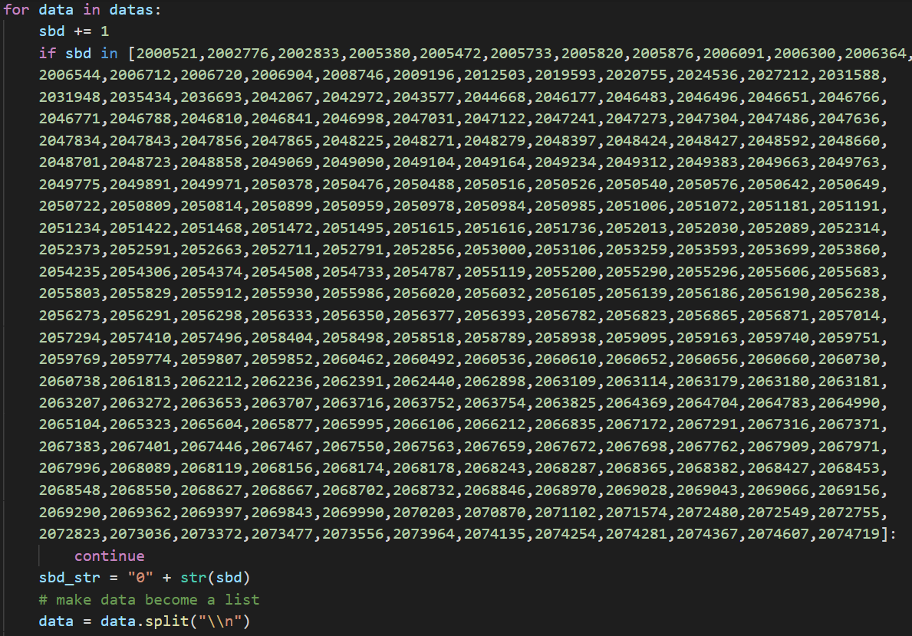

# Analyzing Vietnamese Graduation Score 2020 (HCM City)

**Author: Anh N. Ngo**

---
**References**:
1. Author: Dung Lai Lap Trinh
   - Published on: Oct 24, 2020
   - Title: Phân tích điểm thi đại học 2020 bằng Data Science | Lập Trình Python Cơ Bản Tự Học Cho Người Mới
   - URL: https://www.youtube.com/watch?v=hkF_oIm3lU4&t=2068s
---
# Cleaning Data
From the website of Education & Training Department of HCM City, Vietnam, curl all information about student score, using their ids. 
By several tests, it was achieved that the first id was 2000001 and the last id was 2074719
(All raw data was extracted in the year of 2020, leading to the fact that running the code at the moment may cause errors)

All obtained data is not cleaned, which contained tags, unnecessary codes, unsupported symbols needing to be converted to utf8. 
After coding to process one line and make sure it works properly by using readline(), I applied the same code to the whole dataset using read()

However, while processing cleaning the whole dataset, I realized that some ids were "missing", causing list index out of range. To prevent this, I used a try - except to catch all nonexistent ids, then put them back in to the for loop in an if condition:

I imported csv module to have my clean_data as csv file, as I would use it create a database in pgAdmin and apply some queries using SQL.
Several first lines of my clean_data in VSCode:

Several first lines of my clean_data in pdAdmin:
