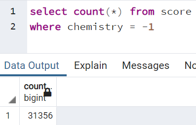

# Analyzing Vietnamese Graduation Score 2020 (HCM City)

**Author: Anh N. Ngo**

---
**Objective:**
- Learn how to clean data curling from a website using Python
- Apply several analytic concepts to choose suitable charts and draw them using matplotlib library 
- Switch mindset from depending on Excel to using Python to solve complex data science problem
- Learn how to use SQL to create a database using clean data extracted and write queries to assess analyzed results

---
**References**:
1. Author: Dung Lai Lap Trinh
   - Published on: Oct 24, 2020
   - Title: Phân tích điểm thi đại học 2020 bằng Data Science | Lập Trình Python Cơ Bản Tự Học Cho Người Mới
   - URL: https://www.youtube.com/watch?v=hkF_oIm3lU4&t=2068s
---
# Cleaning Data
From the website of Education & Training Department of HCM City, Vietnam, curl all information about student score, using their ids. 
By several tests, it was achieved that the first id was 2000001 and the last id was 2074719
(All raw data was extracted in the year of 2020, leading to the fact that running the code at the moment may cause errors)

All obtained data is not cleaned, which contained tags, unnecessary codes, unsupported symbols needing to be converted to utf8. 
After coding to process one line and make sure it works properly by using readline(), I applied the same code to the whole dataset using read()

Several lines of raw_data.txt:

However, while processing cleaning the whole dataset, I realized that some ids were "missing", causing list index out of range. To prevent this, I used a try - except to catch all nonexistent ids, then put them back in to the for loop in an if condition. Nonexistent ids can be found in *error_id.txt*

I imported csv module to have my clean_data as csv file, as I would use it create a database in pgAdmin and apply some queries using SQL.
Several first lines of my clean_data in VSCode:

Several first lines of my clean_data in pgAdmin:

---
# Analyzing Data
From the clean database, I created some charts to answers some of my questions about candidates of the Vietnamese Graduation Exams 2020, Ho Chi Minh City. Some of them includes:
- How many students did not sit for each subject exam, such as Math and History? What is the reason behind this phenomenon? 
- What was the subject exam that most students took?
- What was median, mode, mean scores of each subject?
- Were there any particular errors on the system? 
- Were there any candidates that were older or younger than the general age of candidates in 2020?

**A. How many students did not sit for each subject exam?**

To find the numbers of students who did not sit for each subject exam, first I created a loop through students to find students who did not take the exam then store them as a list: 

The result I got was:
[265, 1802, 49223, 32496, 44131, 44847, 49353, 31849, 31591, 31356, 8709]

Using Matplotlib, I got a barchart indicating these numbers:

Double-check the extracted numbers by randomly choose three subjects: Math, Natural Science, and Chemistry using SELECT COUNT query:

Three randomly selected columns showed a match with the chart coded by Python, I concluded that the result was well completed.

***Insight:***
- Students who did not sit for natural science generally did not sit for chemistry, biology, and physics. It is easily understandable as chemistry, biology, and physics are natural science and are used to create the natural science exam.
- On the other side, even though it can be claimed that students who did not sit for social science had considerably high tendency to not take history, geographic, and physics, there are still gaps existing with around five thousands as shown.
- There were not a lot of students who did not participate in the Math exam. This is due to the fact that math, literature, and english are required exams and not avoidable.

Reversely, I computed a chart showing the number of students taking each exam component:

